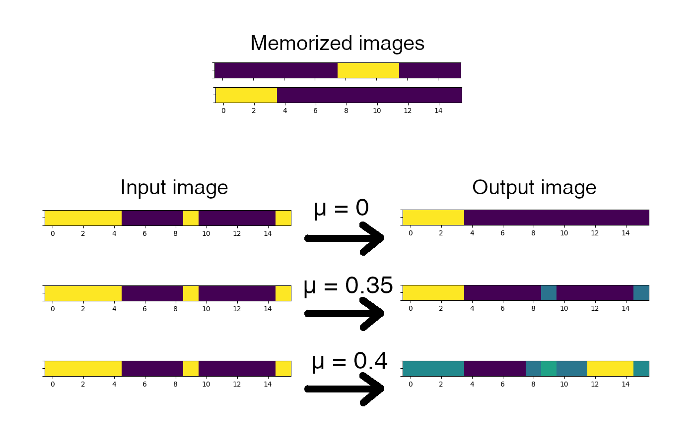

# Hopfield net
Hopfield network based on McCulloch-Pitts neurons (test_4x4.py, test_image.py) and Izhikevich chaotic neurons(test_4x4_chaotic.py, test_image_chaotic.py)

## Example of net's work after 250 iterations
This net consists of 16 neurons, and 2 memorized images. There pictured 3 tests for same input, and diferent μ-params of Izhikevich's neurons. At first test neurons equivalent to McCulloch-Pitts neurons (μ = 0) 
### 

